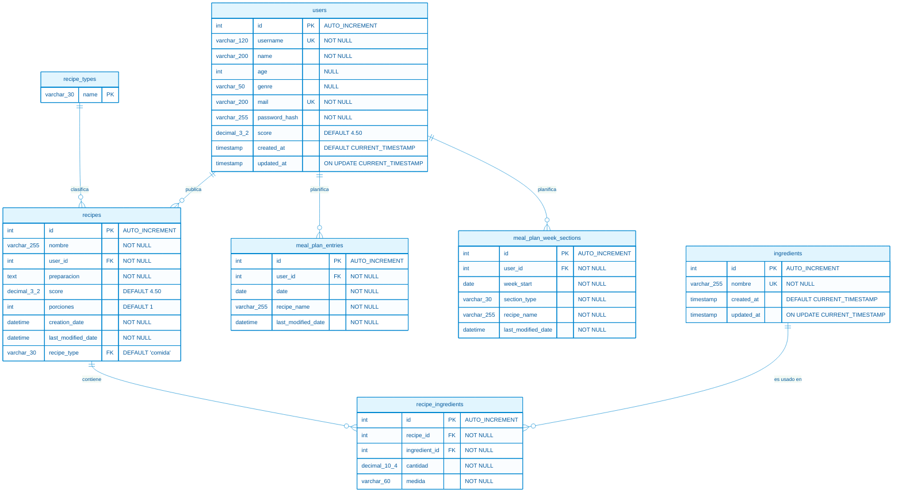

# Modelo de datos – DietApp v2

Documento técnico con el modelo relacional de la aplicación: tablas, columnas, llaves primarias, llaves foráneas, relaciones, diagrama y las consultas críticas con su análisis de índices.

---

## 1. Diagrama entidad-relación



> **Nota:** el diagrama se puede visualizar en cualquier visor de Mermaid (GitHub, GitLab, VS Code con la extensión *Markdown Preview Mermaid Support*), abriendo el archivo `data_model_diagram.html` o directamente como imagen en `data_model_diagram.svg`.

---

## 2. Catálogo de tablas

### 2.1 `users`

Usuarios registrados en la aplicación.

| Columna | Tipo | Nullable | Default | Descripción |
|---------|------|----------|---------|-------------|
| `id` | `INT` | NO | AUTO_INCREMENT | Identificador único del usuario |
| `username` | `VARCHAR(120)` | NO | - | Nombre de usuario único |
| `name` | `VARCHAR(200)` | NO | - | Nombre completo o de perfil |
| `age` | `INT` | SÍ | - | Edad |
| `genre` | `VARCHAR(50)` | SÍ | - | Género |
| `mail` | `VARCHAR(200)` | NO | - | Correo electrónico único |
| `password_hash` | `VARCHAR(255)` | NO | - | Hash de la contraseña |
| `score` | `DECIMAL(3,2)` | NO | `4.50` | Puntuación promedio del usuario |
| `created_at` | `TIMESTAMP` | NO | `CURRENT_TIMESTAMP` | Fecha de alta |
| `updated_at` | `TIMESTAMP` | NO | `CURRENT_TIMESTAMP` | Fecha de última modificación |

- **PK:** `id`
- **UK:** `username`, `mail`
- **FK:** ninguna

---

### 2.2 `recipe_types`

Catálogo de tipos de receta.

| Columna | Tipo | Nullable | Default | Descripción |
|---------|------|----------|---------|-------------|
| `name` | `VARCHAR(30)` | NO | - | Nombre del tipo de receta |

- **PK:** `name`
- **Valores actuales:** `comida`, `sopa`, `complemento`, `otro`

---

### 2.3 `recipes`

Recetas creadas por los usuarios.

| Columna | Tipo | Nullable | Default | Descripción |
|---------|------|----------|---------|-------------|
| `id` | `INT` | NO | AUTO_INCREMENT | Identificador de la receta |
| `nombre` | `VARCHAR(255)` | NO | - | Nombre de la receta |
| `user_id` | `INT` | NO | - | Autor de la receta |
| `preparacion` | `TEXT` | NO | - | Pasos de preparación |
| `score` | `DECIMAL(3,2)` | NO | `4.50` | Puntuación de la receta |
| `porciones` | `INT` | NO | `1` | Número de porciones |
| `creation_date` | `DATETIME` | NO | - | Fecha de creación |
| `last_modified_date` | `DATETIME` | NO | - | Fecha de última modificación |
| `recipe_type` | `VARCHAR(30)` | NO | `'comida'` | Tipo de receta |

- **PK:** `id`
- **FK:**
  - `user_id` → `users(id)` `ON DELETE CASCADE` `ON UPDATE CASCADE`
  - `recipe_type` → `recipe_types(name)` `ON DELETE RESTRICT` `ON UPDATE CASCADE`
- **Índices:**
  - `idx_recipes_user_id` (`user_id`)
  - `idx_recipes_recipe_type` (`recipe_type`)

---

### 2.4 `ingredients`

Catálogo maestro de ingredientes.

| Columna | Tipo | Nullable | Default | Descripción |
|---------|------|----------|---------|-------------|
| `id` | `INT` | NO | AUTO_INCREMENT | Identificador del ingrediente |
| `nombre` | `VARCHAR(255)` | NO | - | Nombre único del ingrediente |
| `created_at` | `TIMESTAMP` | NO | `CURRENT_TIMESTAMP` | Fecha de alta |
| `updated_at` | `TIMESTAMP` | NO | `CURRENT_TIMESTAMP` | Última modificación |

- **PK:** `id`
- **UK:** `nombre`
- **FK:** ninguna

---

### 2.5 `recipe_ingredients`

Relación muchos-a-muchos entre recetas e ingredientes, con cantidad y medida.

| Columna | Tipo | Nullable | Default | Descripción |
|---------|------|----------|---------|-------------|
| `id` | `INT` | NO | AUTO_INCREMENT | Identificador interno |
| `recipe_id` | `INT` | NO | - | Receta a la que pertenece |
| `ingredient_id` | `INT` | NO | - | Ingrediente utilizado |
| `cantidad` | `DECIMAL(10,4)` | NO | - | Cantidad necesaria |
| `medida` | `VARCHAR(60)` | NO | - | Unidad de medida |

- **PK:** `id`
- **FK:**
  - `recipe_id` → `recipes(id)` `ON DELETE CASCADE` `ON UPDATE CASCADE`
  - `ingredient_id` → `ingredients(id)` `ON DELETE RESTRICT` `ON UPDATE CASCADE`
- **Índices:**
  - `idx_recipe_ingredients_recipe_id` (`recipe_id`)
  - `idx_recipe_ingredients_ingredient_id` (`ingredient_id`)

---

### 2.6 `meal_plan_entries`

Planificación diaria de recetas para un usuario.

| Columna | Tipo | Nullable | Default | Descripción |
|---------|------|----------|---------|-------------|
| `id` | `INT` | NO | AUTO_INCREMENT | Identificador de la entrada |
| `user_id` | `INT` | NO | - | Usuario propietario |
| `date` | `DATE` | NO | - | Día del plan |
| `recipe_name` | `VARCHAR(255)` | NO | - | Nombre de la receta asignada |
| `last_modified_date` | `DATETIME` | NO | - | Última modificación |

- **PK:** `id`
- **UK:** `uq_meal_plan_user_date` (`user_id`, `date`)
- **FK:**
  - `user_id` → `users(id)` `ON DELETE CASCADE` `ON UPDATE CASCADE`
- **Índices:**
  - `idx_meal_plan_recipe_name` (`recipe_name`)

---

### 2.7 `meal_plan_week_sections`

Planificación semanal por secciones (complementos u otras categorías).

| Columna | Tipo | Nullable | Default | Descripción |
|---------|------|----------|---------|-------------|
| `id` | `INT` | NO | AUTO_INCREMENT | Identificador de la sección |
| `user_id` | `INT` | NO | - | Usuario propietario |
| `week_start` | `DATE` | NO | - | Inicio de la semana |
| `section_type` | `VARCHAR(30)` | NO | - | Tipo de sección |
| `recipe_name` | `VARCHAR(255)` | NO | - | Nombre de la receta asignada |
| `last_modified_date` | `DATETIME` | NO | - | Última modificación |

- **PK:** `id`
- **UK:** `uq_week_section_recipe` (`user_id`, `week_start`, `section_type`, `recipe_name`)
- **FK:**
  - `user_id` → `users(id)` `ON DELETE CASCADE` `ON UPDATE CASCADE`
- **Índices:**
  - `idx_week_sections_user_week` (`user_id`, `week_start`)

---

## 3. Relaciones

| Tabla origen | Cardinalidad | Tabla destino | Descripción |
|--------------|--------------|---------------|-------------|
| `users` | **1 : N** | `recipes` | Un usuario puede crear muchas recetas |
| `users` | **1 : N** | `meal_plan_entries` | Un usuario tiene muchas entradas de plan diario |
| `users` | **1 : N** | `meal_plan_week_sections` | Un usuario tiene muchas secciones semanales |
| `recipe_types` | **1 : N** | `recipes` | Un tipo puede clasificar muchas recetas |
| `recipes` | **1 : N** | `recipe_ingredients` | Una receta tiene muchos ingredientes |
| `ingredients` | **1 : N** | `recipe_ingredients` | Un ingrediente puede aparecer en muchas recetas |

---

## 4. Queries críticas

A continuación se incluyen las consultas más importantes para la aplicación, junto con un análisis de si necesitan índices adicionales.

### 4.1 Obtener recetas

Listado paginado de recetas, típicamente filtrado por tipo y ordenado por puntuación o fecha.

```sql
SELECT id, nombre, score, porciones, recipe_type, creation_date, last_modified_date
FROM recipes
WHERE recipe_type = 'comida'
ORDER BY score DESC, creation_date DESC
LIMIT 20 OFFSET 0;
```

**Análisis de índices**

- `idx_recipes_recipe_type` acelera el filtro `WHERE recipe_type = 'comida'`.
- Para evitar el *filesort* en `ORDER BY score DESC, creation_date DESC`, se recomienda un índice compuesto:

```sql
CREATE INDEX idx_recipes_type_score_date
ON recipes(recipe_type, score DESC, creation_date DESC);
```

---

### 4.2 Obtener receta con ingredientes

Devuelve una receta completa junto con todos sus ingredientes y cantidades.

```sql
SELECT r.id, r.nombre, r.preparacion, r.porciones, r.score,
       i.id AS ingredient_id, i.nombre AS ingredient_name,
       ri.cantidad, ri.medida
FROM recipes r
JOIN recipe_ingredients ri ON r.id = ri.recipe_id
JOIN ingredients i ON ri.ingredient_id = i.id
WHERE r.id = ?;
```

**Análisis de índices**

- La PK de `recipes(id)` resuelve la búsqueda de la receta.
- `idx_recipe_ingredients_recipe_id` permite traer rápidamente los ingredientes de esa receta.
- La PK de `ingredients(id)` resuelve el JOIN final.
- **No se requieren índices adicionales.**

---

### 4.3 Obtener menú semanal

Devuelve el plan de comidas de un usuario para un rango de fechas (versión diaria) y sus secciones semanales.

```sql
-- Entradas diarias del usuario en un rango de 7 días
SELECT date, recipe_name, last_modified_date
FROM meal_plan_entries
WHERE user_id = ?
  AND date BETWEEN ? AND ?
ORDER BY date;

-- Secciones semanales de una semana concreta
SELECT week_start, section_type, recipe_name, last_modified_date
FROM meal_plan_week_sections
WHERE user_id = ?
  AND week_start = ?
ORDER BY section_type;
```

**Análisis de índices**

- `uq_meal_plan_user_date` (`user_id`, `date`) cubre perfectamente el filtro y orden de la primera consulta.
- `idx_week_sections_user_week` (`user_id`, `week_start`) cubre el filtro de la segunda consulta.
- **No se requieren índices adicionales.**

---

### 4.4 Buscar recetas por usuario

Devuelve todas las recetas creadas por un usuario.

```sql
SELECT id, nombre, recipe_type, score, creation_date
FROM recipes
WHERE user_id = ?
ORDER BY creation_date DESC;
```

**Análisis de índices**

- `idx_recipes_user_id` acelera el filtro `WHERE user_id = ?`.
- Para evitar ordenar por fecha en memoria, se recomienda un índice compuesto:

```sql
CREATE INDEX idx_recipes_user_created
ON recipes(user_id, creation_date DESC);
```

---

### 4.5 Búsqueda de recetas por ingrediente (extra)

Permite encontrar recetas que contengan un ingrediente concreto.

```sql
SELECT r.id, r.nombre, r.recipe_type, r.score
FROM recipes r
JOIN recipe_ingredients ri ON r.id = ri.recipe_id
JOIN ingredients i ON ri.ingredient_id = i.id
WHERE i.nombre LIKE '%?%';
```

**Análisis de índices**

- `LIKE '%texto%'` no aprovecha el índice `UNIQUE` de `ingredients.nombre`.
- Si la búsqueda por nombre es frecuente, conviene migrar a búsqueda de texto completo:

```sql
CREATE FULLTEXT INDEX idx_ingredients_name
ON ingredients(nombre);
```

y reescribir la consulta con `MATCH ... AGAINST`.

---

### 4.6 Login / autenticación (extra)

Obtiene el hash de contraseña a partir del usuario o correo.

```sql
SELECT id, password_hash
FROM users
WHERE username = ? OR mail = ?;
```

**Análisis de índices**

- Las restricciones `UNIQUE` sobre `username` y `mail` crean índices implícitos, por lo que la consulta es muy rápida.
- **No se requieren índices adicionales.**

---

## 5. Resumen de índices recomendados

| Tabla | Índice recomendado | Motivación |
|-------|--------------------|------------|
| `recipes` | `(recipe_type, score DESC, creation_date DESC)` | Listados filtrados por tipo y ordenados por puntuación/fecha |
| `recipes` | `(user_id, creation_date DESC)` | Perfil de usuario ordenado por fecha |
| `ingredients` | `FULLTEXT(nombre)` | Búsquedas flexibles por nombre de ingrediente |

---

## 6. Notas y recomendaciones

1. **Normalización del menú semanal:** `meal_plan_entries.recipe_name` y `meal_plan_week_sections.recipe_name` almacenan el nombre de la receta como texto. Para poder generar automáticamente una lista de compras, calcular macros/nutrientes o mantener la integridad referencial, se recomienda cambiar estas columnas por una FK a `recipes(id)`.
2. **Integridad de tipos:** `recipe_type` tiene `ON DELETE RESTRICT`, lo cual impide borrar un tipo de receta mientras existan recetas asociadas. Esto es correcto para mantener la consistencia del catálogo.
3. **Borrado en cascada:** `recipes`, `meal_plan_entries` y `meal_plan_week_sections` usan `ON DELETE CASCADE` respecto a `users`. Al eliminar un usuario se eliminan sus recetas y planes; considerar si esto es el comportamiento deseado en producción.
